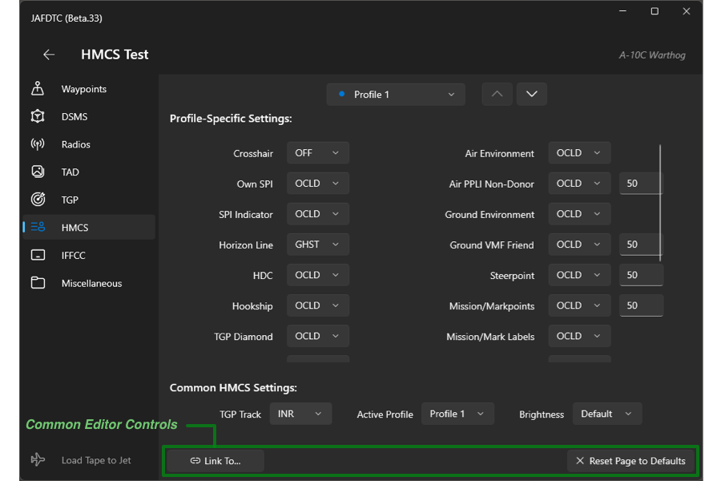
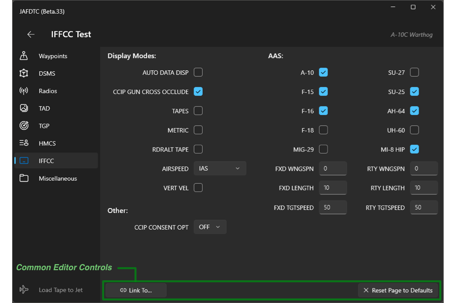
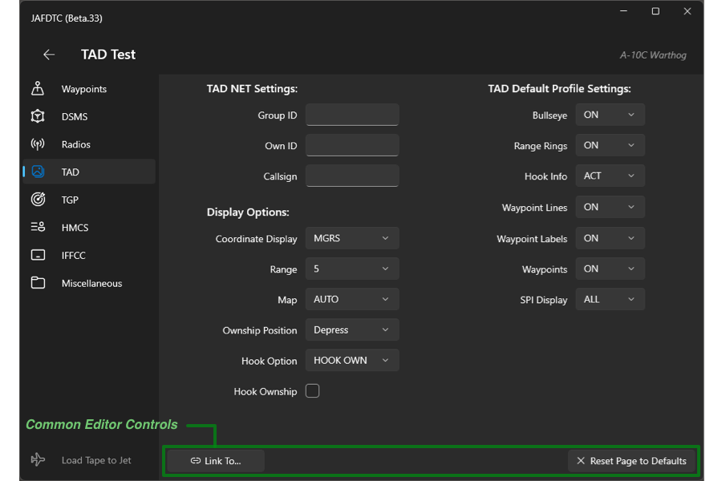
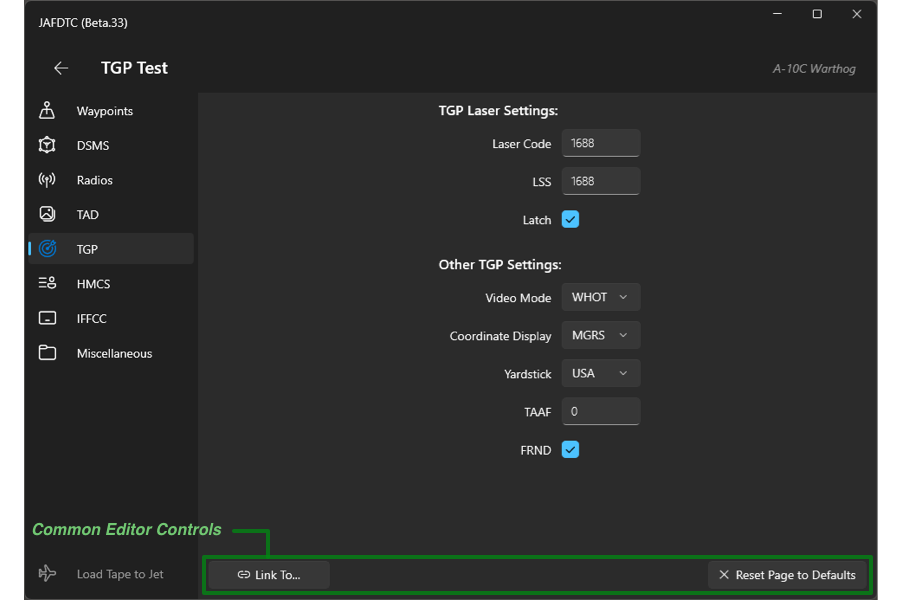
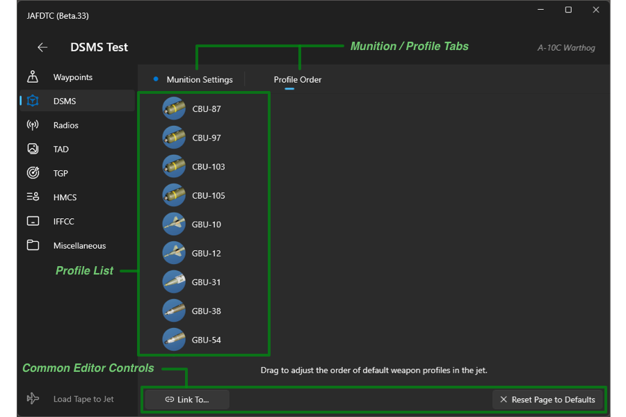
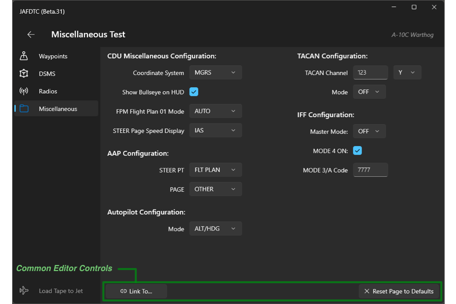

# JAFDTC: Configuring A-10C Warthog Airframes

*Version 1.0.0-B.34 of 8-June-24*

JAFDTC supports configuration of the following systems in the A-10C II Warthog,

* DSMS
* HMCS
* IFFCC
* Radios
* TAD
* TGP
* Waypoints
* Miscellaneous Systems

Each of these areas is covered in more depth below. See the
[_User's Guide_](https://github.com/51st-Vfw/JAFDTC/tree/master/doc/README.md) and
[_Common Elements Guide_](https://github.com/51st-Vfw/JAFDTC/tree/master/doc/Common_Elements.md)
for more on the aspects of JAFDTC that are common to multiple airframes.

> JAFDTC does not support the original DCS A-10C module.

# DCS Cockpit Integration

> This functiuonality requires installation of the DCS Lua support.

The Warthog allows the user to operate JAFDTC from buttons in the cockpit without needing to go
through the Windows UI. This is helpful for VR and other situations where you may not be able
to interact with the JAFDTC window. To support this capabilty, JAFDTC reuses controls from
the UFC panel that have no function in the the A-10C that the module models.

JAFDTC currently supports the following functions from the Hawg cockpit,

* **IFF** &ndash; Pressing and briefly holding this button causes JAFDTC to load the
  currently selected A-10C configuration into the jet. JAFDTC provides feedback during the
  upload according to the **Upload Feedback**
  [setting](https://github.com/51st-Vfw/JAFDTC/tree/master/doc/README.md#settings).
* **COM SEC** &ndash; Changes the currently selected configuration on the
  [Configuration List Page](https://github.com/51st-Vfw/JAFDTC/tree/master/doc/README.md#configuration-list-page)
  to the previous configuration.
* **ECCM** &ndash; Changes the currently selected configuration on the
  [Configuration List Page](https://github.com/51st-Vfw/JAFDTC/tree/master/doc/README.md#configuration-list-page)
  to the next configuration.
* **IDM R/T** &ndash; Toggles pinning the JAFDTC window to the top of the window stack over the
  DCS window.

The initial press of **COM SEC** or **ECCM** will briefly display the name of the currently
selected configuration. Subsequent presses step up or down through the configuration list.

Other functions may be implemented later.

# Configurable Systems on the Warthog

A Warthog configuration supports settings spanning the systems listed above. All systems
implement the link and reset functionality mentioned in the overview of the
[system editor page](https://github.com/51st-Vfw/JAFDTC/tree/master/doc/README.md#system-editor-page).

Prior to uploading, you should ensure the relevant systems are powered up and functional.
Typically, uploads should occur as one of the last steps prior to taxi once you have systems
powered up, stores loaded, and so on.

Most of the A-10 systems (everything except the COMM page for the ARC-210) must be in their default position on the MFDs, or their setup will be skipped. This may be improved upon in future releases.

## HMCS

The HMCS system allows modification of every HMCS setting that has a DCS function. If you notice some that are missing, they were omitted for this reason.

Each of the the HMCS profiles' settings can be modified in the middle section of this screen. The tooltips shown by hovering the mouse cursor over each field gives an explanation from the flight manual of each setting's purpose.

Common settings that apply to all profiles are at the bottom of this editor.

- **TGP Track** selects the type of track the TGP will use when initiated from the HMCS with DMS-right-long.
- **Active Profile** will set one of the three HMCS profiles active when done configuring.
- **Brightness** selects either DAY or NIGHT brightness levels.

## IFFCC

The IFFCC system allows changing its myriad of HUD display options.

In the left column:

- **AUTO DATA DISP** briefly displays release data on the HUD.
- **CCIP GUN CROSS OCCLUDE** occludes the TVV behind the CCIP gun cross.
- **TAPES** displays speed and altitude tapes instead of digital values.
- **METRIC** displays HUD data values in metric rather than imperial units.
- **RDRALT TAPE** displays a vertical tape indicating radar altitude.
- **AIRSPEED** changes the airspeed displayed. Options include IAS, MACH/IAS, GS, and TRUE.
- **VERT VEL** displays vertical velocity on the left side of the HUD.
- **CCIP CONSENT OPT** changes the CCIP release symbology. Options include OFF, 5 MIL, and 3/9.

In the right column, the **AAS** section configures Air-to-Air master mode HUD options. You can select which airframe presets will appear in the list when using DMS left and right. You can also enter a wingspan, length, and speed for two additional manual presets, one rotary and one fixed wing.

## Radios

The system editor for the communications system in the Warthog follows the general outline of
the common
[Communications System Editor](https://github.com/51st-Vfw/JAFDTC/tree/master/doc/Common_Elements.md#communications-system-editors)
with some small changes for capabilities of the Warthog radios. The configuration supports all 3 radios:
AN/ARC-210, AN/ARC-164 and AN/ARC-186.

The AN/ARC-164 VHF AM radio closely follows the common communication systems editor and allows you
to specify preset frequencies and other configuration.

The airframe specific controls for the AN/ARC-164 include

- **Initial Freq./Preset** &ndash; Specifies the initial frequency or preset to tune the
  radio to. For example, "15" sets the radio to preset 15 while "251.00" sets the radio to
  the manual frequency 251.00.
- **Preset Mode** &ndash; When selected, radio select frequencies through presets; otherwise,
  frequencies are set manually.
- **Monitor Guard** &ndash; When selected, configures the radio to automatically monitor the
  UHF guard frequncy.

Other controls work as described in
[Communications System Editor](https://github.com/51st-Vfw/JAFDTC/tree/master/doc/Common_Elements.md#communications-system-editors)
documentation.

The AN/ARC-210 all-frequency radio supports selectable modulation (FM or AM) on some frequency bands. In
addition to the Preset, Frequency, and Description information, this radio includes a drop
down menu to select modulation.

After changing the preset frequency, the modulation is initially set to the default modulation
for the frequency. The first item in the modulation drop down menu is always the default
modulation for the preset.

The airframe specific controls for the AN/ARC-210 include

- **Initial Freq./Preset** &ndash; Specifies the initial frequency or preset to tune the
  radio to. For example, "15" sets the radio to preset 15 while "251.00" sets the radio to
  the manual frequency 251.00.
- **Preset Mode** &ndash; When selected, radio select frequencies through presets; otherwise,
  frequencies are set manually.
- **Monitor Guard** &ndash; When selected, configures the radio to automatically monitor the
  UHF guard frequncy.
- **COM1 on HUD** &ndash; When selected, show the COM1 tuning information for the AN/ARC-210 in the
  HUD.

Other controls work as described in
[Communications System Editor](https://github.com/51st-Vfw/JAFDTC/tree/master/doc/Common_Elements.md#communications-system-editors)
documentation.

The AN/ARC-186 VHF FM radio's functionality is identical to the AN/ARC-164 except that there is no monitor guard option.

## TAD

**TAD NET Settings** allow for changing the Group ID, Own, ID, and Callsign used for SADL and datalink. Leaving them blank makes no changes, leaving the mission editor's configuration. Note that given the buggy state of datalink in May 2024, leaving them blank is often the better choice.

Most of the display options should be self-evident. **Hook Ownship** will hook your own ship to leave the hook option coordinate display visible. This is useful for e.g. the BULL CURS option, displaying a bullseye reference to your cursor even with nothing else hooked.

JAFDTC does not support creation of additional TAD display profiles, but allows changes to the default, initial profile with settings in the right column.

## TGP

In addition to being on the default button on the right-side MFD, the TGP must be fully timed out when its settings are loaded from JAFDTC or it will be skipped.

The settings available in the TGP system editor are mostly self-explanatory, exactly matching commonly set options in the jet. Some less commonly known settings include:

- **Yardstick** is the length of one side of the TGP boresight cross. This option allows showing its length in metric units, USA freedom units, or turning the display off.
- **TAAF** (TGP Attitude Advisory Function) defaults to 0, which is off. If an altitude is set, below that altitude a warning appears on both MFDs at high bank angles.
- **FRND** turns off X marks of EPLRS-enabled friendlies. If you're the sort of psychopath who would turn this off at startup, here's your chance.

## Waypoints

JAFDTC uses the common
[Navigation System Editor](https://github.com/51st-Vfw/JAFDTC/tree/master/doc/Common_Elements.md#navigation-system-editors)
interface to set up the Warthog *Waypoint* system. Waypoints in the Warthog include elevation
and DDM (degrees, decimal minutes) formatted latitude and longitude to identify positions.

## DSMS

JAFDTC supports the most common changes made in the DSMS for PGMs and cluster bombs.

The **Munition Settings** tab allows modification of commonly changed options on both the INV page and the default profiles. Any changes you make to a weapon type here will be applied to the weapon wherever it is loaded on the jet.

Note that the **Laser Code** setting applies to all laser weapons. You don't need to set it for each laser weapon type.

The **Profile Order** tab allows setting the order of the default profiles. The list can be dragged into the desired order. Any profiles present in the jet will be sorted as shown. Any profiles not listed here but present in the jet will be sorted to the end of the list.

#### Not (Yet?) Supported

- There is no support for the creation of custom weapon profiles with varying settings.
- Settings for less commonly used munitions are not here: unguided bombs or rockets, training munitions, illumination rockets, etc.

## Miscellaneous

The miscellaneous system covers a number of smaller systems accessed through the Hawg CDU
and other interfaces including CDU, AAP, autopilot, TACAN, and IFF. Many of these settings would typically be changed often in flight. The idea behind having them here is getting them set as desired before taxi/takeoff.

Most of these settings should be self-apparent. For the CDU,

- **Coordinate System** allows changing from the default L/L to MGRS. This only affects the CDU at present, not the TAD or TGP.
- **Bullseye on HUD** will make visible your aircraft's BULLS position in the upper right corner of the HUD.
- **FPM Flight Plan 01** allows changing the default flight plan, on the CDU FPM page, between manual and automatic waypoint advancement.
- **STEER Page Speed Display** changes the speed displayed on the CDU's STEER page between IAS, TAS, and GS.

For the AAP,

- **STEER PT** sets the AAP's STEER PT knob. Options are Flt Plan, Mark, and Mission.
- **PAGE** sets the AAP's PAGE knob. Options are Other, Position, Steer, and Waypt.

For the autopilot,

- **Mode** allows setting the autopilot mode switch between PATH, ALT/HDG, and ALT.
