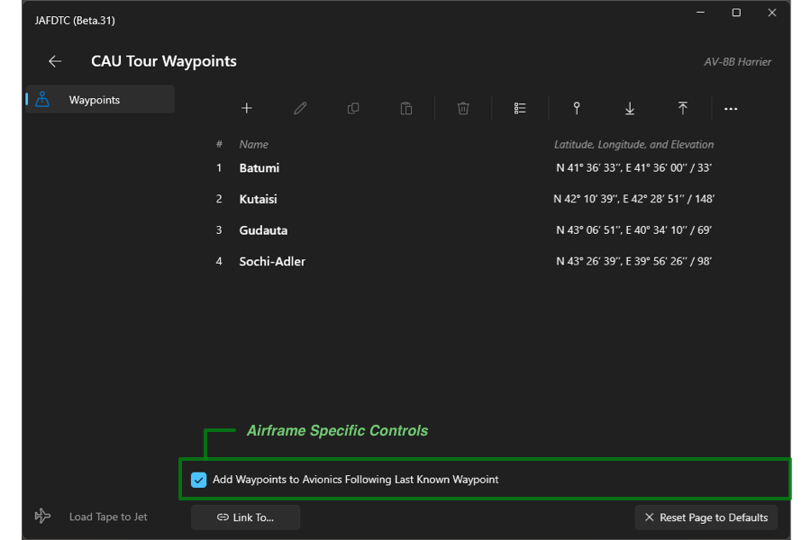

# JAFDTC: Configuring AV-8B Harrier Airframes

**_Version 1.0.0 of 17-September-24_**

> Support for the *Harrier* is experimental and has had limited testing.

JAFDTC supports configuration of the following systems in the AV-8B Harrier,

* Waypoints

Each of these areas is covered in more depth below. See the
[_User's Guide_](https://github.com/51st-Vfw/JAFDTC/tree/master/doc/README.md) and
[_Common Elements Guide_](https://github.com/51st-Vfw/JAFDTC/tree/master/doc/Common_Elements.md)
for more on the aspects of JAFDTC that are common to multiple airframes.

# DCS Cockpit Integration

The Harrier does not map any cockpit controls to JAFDTC functions.

# Configurable Systems

Harrier configurations support settings spanning the systems listed earlier. The discussion in
this section focuses on elements that are unique to the Harrier while the
[_Common Elements Guide_](https://github.com/51st-Vfw/JAFDTC/tree/master/doc/Common_Elements.md)
covers elements that are common across all airframes in JAFDTC.

## Waypoints

JAFDTC uses the common core
[Navigation System](https://github.com/51st-Vfw/JAFDTC/tree/master/doc/Common_Elements.md#navigation-system-editors)
interface to configure the Harrier *Waypoint* system. The core system operates as described
in the 
[_Common Elements Guide_](https://github.com/51st-Vfw/JAFDTC/tree/master/doc/Common_Elements.md).
The Tomcat version of the core navigation system uses DMS (Degrees, Minutes, Seconds) formatted
latitudes and longitudes and captures elevations in feet.

The waypoint list page includes controls specific to the Harrier that are not present in the
core navigation system.

When checked, the "Add Waypoints to..." check box causes JAFDTC to append the listed waypoints
to the Harrier waypoint list after the last known waypoint. When unchecked, the waypoints will
overwrite the Harrier waypoint list.