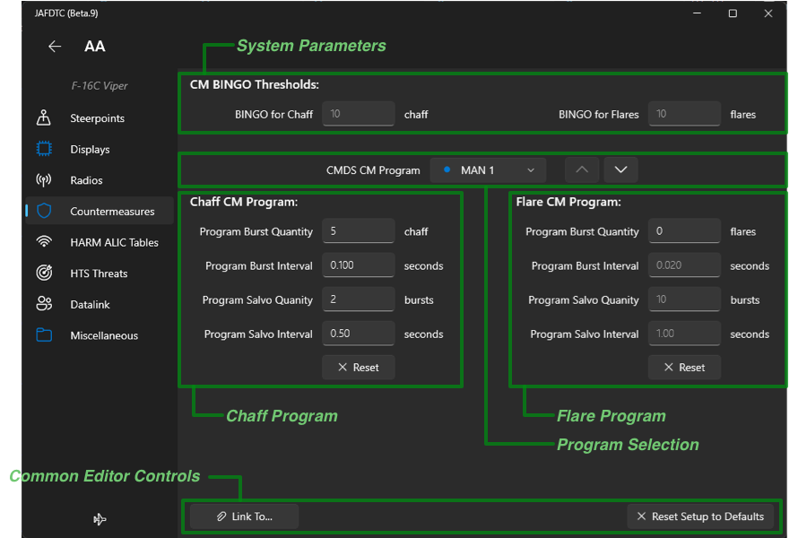
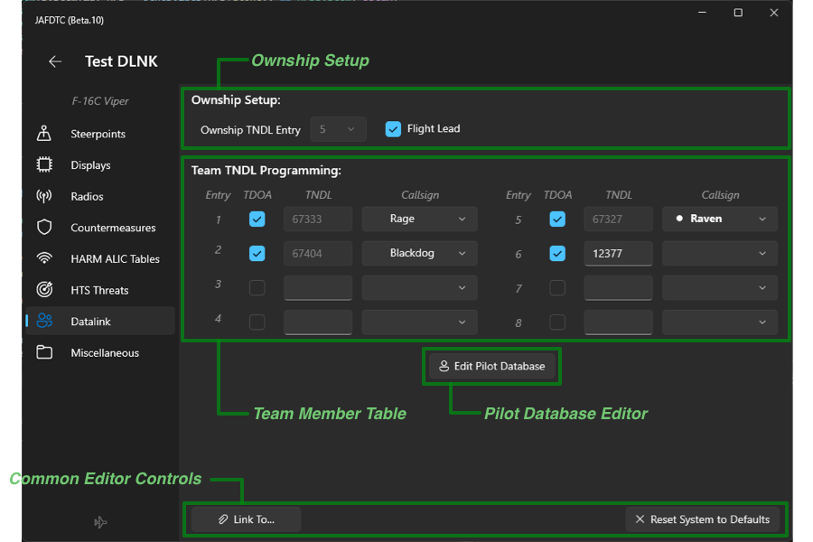
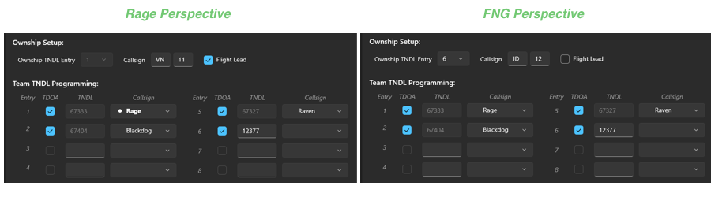
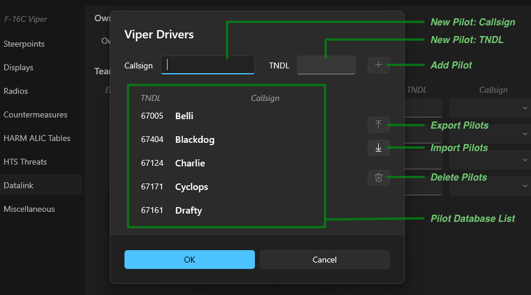
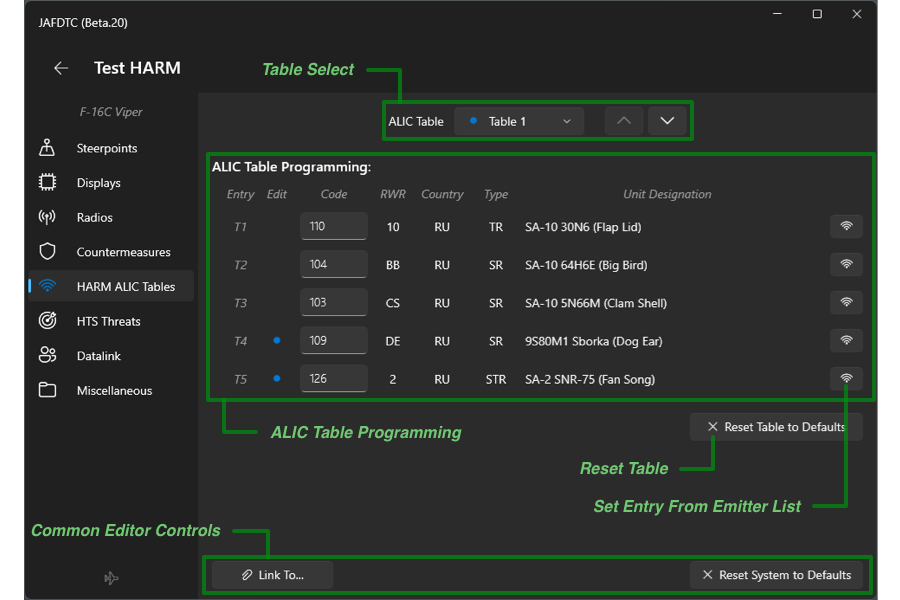
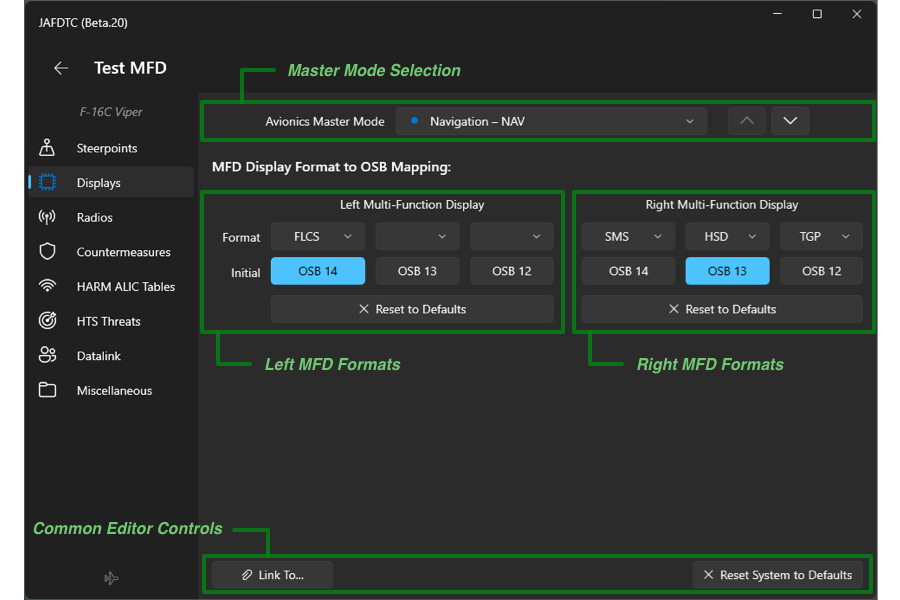
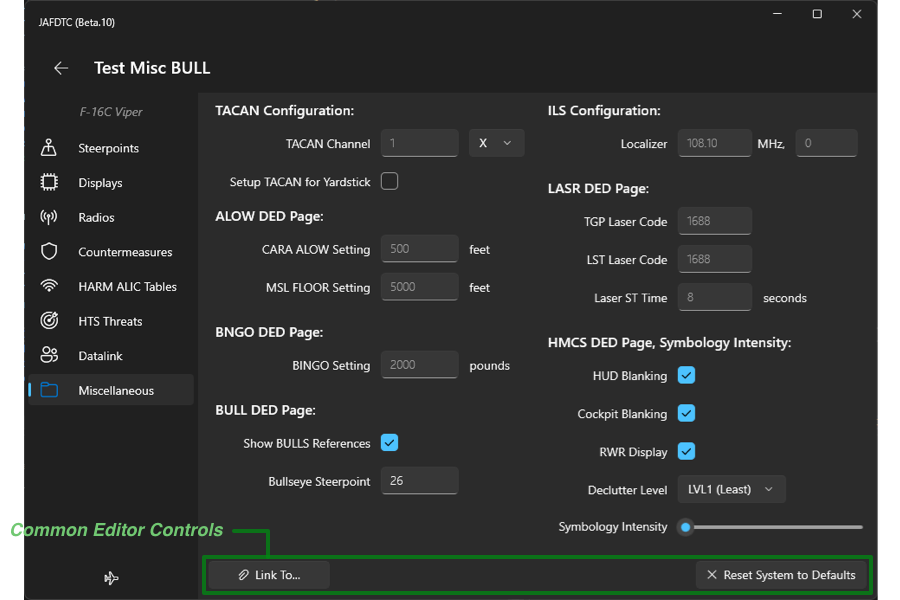
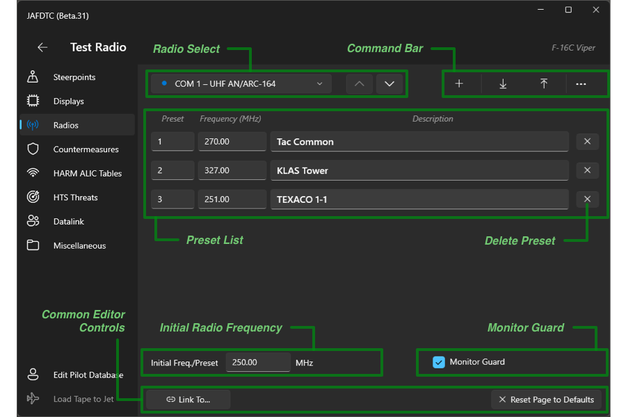
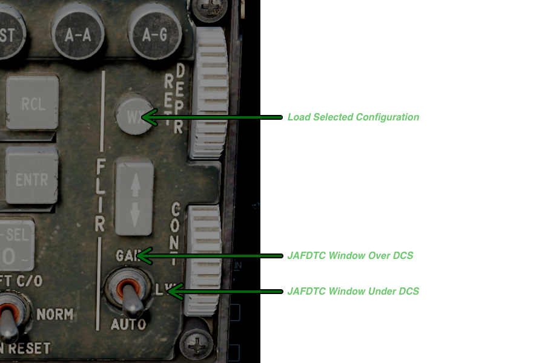

# JAFDTC: F-16C Viper Configurations

*Version 1.0.0 of TODO*

JAFDTC supports the following configuration in the Viper,

* CMDS countermeasures sytem
* DLNK datalink system
* HARM ALIC threat tables
* HARM HTS manual threat table and sensor threat classes
* MFD formats across all master modes and initial format selections
* Miscellaneous DED systems such as TACAN/ILS, ALOW, BNGO, BULL, LASR, and HMCS DED/UFC
  along with HMCS intensity
* COM1/COM2 radio presets and initial configuration
* STPT steerpoint system including OAP, VIP, and VRP reference points

Each of these areas is covered in more depth below.

# Configurable Systems on the Viper

A Viper configuration supports settings spanning eight different systems as described below.
Each of these systems implements the link and reset functionality mentioned in the overview
of the
[system editor page](https://github.com/51st-Vfw/JAFDTC/tree/master/doc/README.md#system-editor-page).

## CMDS: Countermeasures

The countermeasures system manages parameters set through the CMDS DED page. These parameters
contorl the operation of the countermeasures and allow you to setup different programs for the
chaff and flare dispensers.

The top row of the editor adjusts overall parameters of the countermeasures system while the
bottom portion allows you to edit specific countermeasure programs in the countermeasure
system.  The common controls implement the link and reset functionality described
[earlier](https://github.com/51st-Vfw/JAFDTC/tree/master/doc/README.md#common-editor-controls).

### Countermeasure System Parameters

The system parameters include the BINGO levels for chaff and flares. These values determine
the number of consumables (flares or chaff) that trigger a BINGO warning from the avionics.

### Countermeasure Programs

The Viper supports six countermeasure programs: MAN1, MAN2, MAN3, MAN4, PANIC, and BYPASS. The
program selection menu selects which of the programs is being edited in the chaff and flare
columns below. A blue dot next to the program name in the menu indicates the program has been
changed from default values.

In the chaff and flare columns, you can edit the burst quantity (BQ), burst interval (BI),
salvo quantity (SQ), and salvo interval (SI) parameters for the program selected in the
program menu. The background of the field will turn red if you enter a value that is outside
of the allowable range. Clicking the reset button at the bottom of the column will reset all
four of the parameters (BQ, BI, SQ, and SI) in the column to their default values.

## DLNK: Datalink

The datalink system manages parameters set through the DED DLNK page. These parameters control
operation of the datalink system and allow you to assign aircraft to your "team" for the
purpose of sharing information. By default, the system shares contact information between the
team and may optionally share information used by the HTS pod to locate emitters.

As an example, consider the following setup for a sortie where Venom and Jedi flights will work
together on SEAD tasking,

|Flight     |Pilot     |TNDL   |   |Flight    |Pilot      |TNDL   |
|:---------:|:--------:|:-----:|---|:--------:|:---------:|:-----:|
| Venom 1-1 | Rage     | 67333 |   | Jedi 1-1 | Raven     | 67327 |
| Venom 1-2 | Blackdog | 67404 |   | Jedi 1-2 | Cadet FNG | 12377 |

Here, we have two 2-ships that are going to be part of the same team. We will set the data link
up such that Venom shows up as #1 and #2 on HSD and Jedi shows up as #5 and #6. All four jets
will share HTS information.

The datalink system editor page looks like this (from Raven's perspective),

The top-most section of the page allows you to select the table entry for your ownship and
whether or not you are a flight lead. As we shall discuss shortly, JAFDTC will automatically
set the ownship table entry when it can determine which entry corresponds to the ownship. The
common controls implement the link and reset functionality described
[earlier](https://github.com/51st-Vfw/JAFDTC/tree/master/doc/README.md#common-editor-controls).

> JAFDTC does not currently handle callsigns through the DED DLNK page.

The middle part of the page allows you to edit the entries in the table that specify the team
members. For each table entry, there are three controls,

* *TDOA* enables or disables sharing of HTS information within the team.
* *TNDL* specifies the five-digit octal code assigned to the jet (that is, 5 digits where all
  digits are between 0 and 7, inclusive).
* *Callsign* allows you to select a pilot from the pilot database or a "generic" pilot.

The TNDL field is only editable if the callsign control does not select a pilot from the pilot
database (in this case, the callsign control is blank as in entry 6 above). The background of
the TNDL field will turn red when the value in the field is invalid. Selecting yourself from
the pilot database will cause JAFDTC to track the corresponding entry as your ownship. Your
pilot entry in the database is indicated by a bullet (see entry 5 above) and is determined by
looking for a callsign in the pilot database that matches the callsign set through the
[JAFDTC settings](https://github.com/51st-Vfw/JAFDTC/tree/master/doc/README.md#settings).

### Setting Up Multiple Pilots

All four pilots will set up the datalink team table with the same pilots in the *same* entries.
That is, all four pilots will have Rage in entry 1, Blackdog in entry 2, Raven in entry 5 and
FNG in entry 6. What each of them sees will differ though,

Here, Rage's perspective is on the left and FNG's perspective is on the right. For Rage,

* JAFDTC recognizes entry 1 as ownship since the callsign ("Rage") matches the callsign in
  the JAFDTC settings and sets the ownship entry to 1 (note the ownship control is disabled).
* JAFDTC fills in the TNDL with the value from the pilot database (67333).
* As Rage is flight lead for Venom, he will check "Flight Lead".
* The table matches Raven's table above in terms of who within the sortie occupies which
  entries. Note that Rage's callsign is shown with the bullet from his perspective.

For FNG,

* The callsign is set to "generic" (that is, blank), FNG must set his ownship entry manually
  to 6 (note the ownship control is enabled).
* As FNG is a wingman ("...and if you're not a wingman, then to hell with you..." - DG), she
  does not check flight lead.
* As the callsign is generic, FNG must enter her TNDL (12377) into the TNDL field in entry 6.
* Again, the team members are the same.

The button below the team member table allows you to modify the pilot database.

### Pilot Database

The pilot database associates callsigns with fixed TNDL numbers to allow you to rapidly
construct datalink configurations. Clicking on this button brings up the pilot database
editor,

The dialog is made up of three regions:

* The list in the center lists the currently defined pilots and their assigned TNDLs.
* The top part of the dialog allows you to enter a new pilot and TNDL.
* The right edge of the dialog has controls to manipulate the database.

To add a new pilot, simply enter a unique callsign (case is ignored) along with a vaild 5-digit
TNDL, then click the `+` button. The background of either of these fields will be red if they
contain an invalid value. You will not be allowed to add a pilot until both the callsign and
TNDL value are valid.

To delete pilots, select them in the pilot list in the center of the display. The list supports
multiple selections (with either `SHIFT` or `ALT` clicks as normal). After selecting the pilots
to delete, click the trashcan icon to perform the delete.

The import and export buttons allow you to share pilot databases with others. To export, you
select the pilots that you want to share and click the export button (remember, you can
select multiple pilots from the list). This will bring up a standard file selection dialog
that will let you specify a file to save the exported information to.

## HARM ALIC

TODO

TODO

## HARM HTS

TODO

## MFD Formats

The MFD formats configuration selects which display formats are associated with OSB 12-14 on
the left and right MFDs. This mapping between OSB and display format is unique to each
master mode (NAV, A2G, A2A, Dogfight Missile Override, and Dogfight Override).

The top row of the editor has a menu to select the master mode to update. The up and down
chevron buttons to the right of the menu step through the modes in the menu.  The common
controls implement the link and reset functionality described
[earlier](https://github.com/51st-Vfw/JAFDTC/tree/master/doc/README.md#common-editor-controls).

Below the master mode selection controls are two groups of controls that setup the
configuration for the left and right MFD in the selected master mode. The *Reset* button will
return the MFD format setup to default. The *Format* and *Initial* rows set the format and
initially-selected OSB for the MFD.

For example, in the screen shot above, the right MFD is set up as follows:

* OSB 14: SMS format, this OSB is selected initially
* OSB 13: HSD format
* OSB 12: TGP format

To change the initially selected format, simply click the OSB button below the formats for a
display. You can change the format by clicking on the format menu above the particular OSB
button. For example, the format for OSB 13 is set through the menu directly above the OSB 13
button. A non-blank format may appear on only one MFD under one OSB for any given master mode.
For example, in the screen shot above, if you were to set OSB 13 on the left MFD to the TGP
format, the OSB 12 format on the right MFD would change to blank. Configurations for different
master modes may be unique.

## Miscellaneous

The miscellaneous system covers a number of smaller systems accessed through the Viper DED
including TACAN/ILS, ALOW, BNGO, BULL, LASR, and HMCS DED/UFC pages.

Most of these settings should be self-apparent. Yardstick setup will set the TACAN to A/A mode.
The Symbology Intensity control will set the intensity knob to control the HMCS brighness.  The
common controls implement the link and reset functionality described
[earlier](https://github.com/51st-Vfw/JAFDTC/tree/master/doc/README.md#common-editor-controls).

## COM1/COM2: Radios

The communications configuration allow you to update the presets and initial configuration of
the COM1/COM1 radios in the Viper. This configuration includes the presets as well as the
initial radio frequency and guard monitor.

The top row of page selects the radio to operate on and supports several commands while the
lower section details the settings for the selected radio.  The common controls implement the
link and reset functionality described
[earlier](https://github.com/51st-Vfw/JAFDTC/tree/master/doc/README.md#common-editor-controls).

### Radio Selection and Command Bar

The top row allows you to select the radio to edit along and perform some common commands. On
the left, the radio select menu, strangely enough, selects the radio to edit. As with other
editors, a blue dot next to the radio in the radio select menu indicates the setup for the
radio has been edited. Also, like other editors, the up and down chevrons step through the
available radios.

On the right of the row is a group of three commands. From left to right the commands are,

* *Add* creates a new preset and adds it to the preset list.
* *Import* imports presets from a previously exported radio setup file.
* *Export* exports presets to a radio setup file suitible for import.

Commands may be disabled. For example, add is disabled when there are no more preset slots
available in the radio.

### Preset List

The preset list shows all of the defined presets. Each preset has a preset number, frequency,
and brief description. When entring a preset or frequency, the background of the field will
turn red when the value is invalid. On the right end of each row, there is a button to delete
the preset.

Below the preset list is a field to set the initial frequency or preset to select after
uploading the configuration to the jet. The background of this field will turn red if the
value is invalid.

> Note that unless there is an initial frequency or preset specified, JAFDTC will not change
> the frequency tuned on a radio from the default frequency.

Also, the COM1 (UHF) radio can be set to monitor guard through the checkbox on the right
under the preset list.

## STPT: Steerpoints

TODO

# DCS Cockpit Interactions

The Viper allows the user to operate JAFDTC from buttons in the cockpit without needing to go
through the Windows UI.

> This capability requires installation of the DCS Lua support. 

This capability reuses controls from the FLIR panel on the UFC as these controls are not used
by the Block 50 Viper that DCS models as the following figure illustrates,

JAFDTC currently supports three functions from the Viper cockpit,

* Pressing and holding the FLIR `WX` button for about 0.25s causes JAFDTC to start loading
  the currently selected configuration into the jet if it is compatible. JAFDTC provides
  audio feedback for the start (single beep), end (two beeps), and status (error buzz) of
  this operation.
* Flipping the 3-position FLIR `GAIN/LVL/AUTO` switch to `GAIN` will keep the JAFDTC window
  on top of the DCS window in the window stack, regardless of the "on top" setting.
* Flipping the 3-position FLIR `GAIN/LVL/AUTO` switch to `LVL` will allow the JAFDTC window
  to be below the DCS window in the window stack, regardless of the "on top" setting.

Other functions may be implemented later.