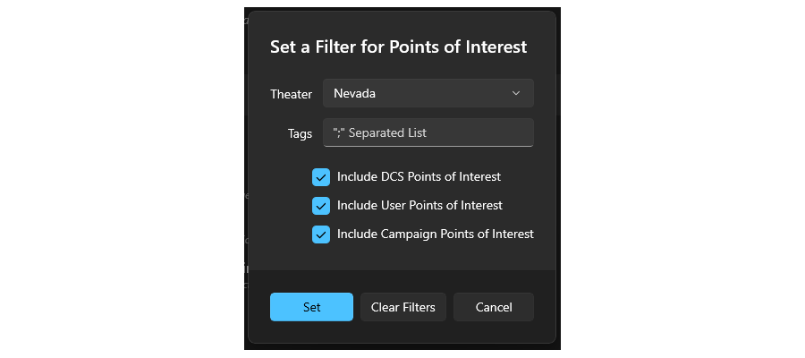
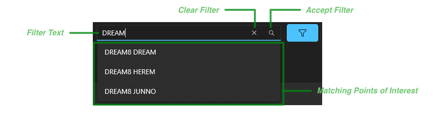

# JAFDTC: Common Elements Guide

*Version 1.0.0-B.31 of 5-May-24*

Though systems differ from airframe to airframe, based on the preculariites of the airframe,
there are many concepts, layouts, and tasks in the JAFDTC user interface that share general
similarities across airframes even where the specifics differ. This section discusses these
common areas.

> As usual, consult the
> [airframe-specific documentation](https://github.com/51st-Vfw/JAFDTC/tree/master/doc/README.md#jafdtc-users-guide)
> for further details on a particular airframe.

# Common Interface Tasks

The JAFDTC user interface has tasks that can be used in multiple contexts within an airframe as
well as tasks that may share some common features between different airframes. This section
discusses some of these common tasks.

## Applying Configurations to the Jet

The primary interaction between JAFDTC and DCS involves uploading configurations to the jet. To
upload a configuration, four conditions must hold,

1. The DCS scripting support must be
   [installed](#support-scripts)
2. DCS must be running
3. A configuration must be selected in the configuration list
4. A mission must be running with a pilot in pit in an airframe that matches the airframe of
   the selection in (3)

The lower left corner of the main configuration list page indicates the status conditions 2-4
as
[discussed earlier](https://github.com/51st-Vfw/JAFDTC/tree/master/doc/README.md#status-area).
Once these conditions are met, you can use any of the **Load to Jet** buttons in the interface
to load the currently selected configuration to the jet.

Generally, the upload should take place before any changes are made to the avionics with all
relevant systems powered up. Typically, shortly before taxi.

> In some cases, it is difficult to impossible for JAFDTC to get the jet in a known
> configuration from a non-default starting point. In these situations, JAFDTC must rely on the
> avionics being in a known state coming out of a cold or hot start. For example, if there is a
> 4-position switch whose setting JAFDTC is unable to read, JAFDTC will not be able to reliably
> set the switch to a particular setting except if assumes the switch hasn't changed positions
> since mission start.
>
> For these reasons, it is generally advisable to perform uploads prior to manually changing
> any avionics settings that overlap with those in the configuration.

Because JAFDTC works through the clickable cockpit, you should limit your interactions with
cockpit switches while JAFDTC is loading a configuration. Interacting with controls that
JAFDTC will use can cause incorrect command sequences that will mess up the configuration.

## Selecting & Filtering Points of Interest

JAFDTC uses a common set of UI widgets to allow you to select points of interest to provide the
coordinates for a navigation point, for example, or to filter a list of points of interest. The
widgets include a search box with a filter button to its right. The filter button allows you to
limit the points of interest to those that meet certain criteria. When a filter is applied, the
filter button will be blue as shown here,

Clicking the filter button brings up a dialog that lets you specify filter criteria,

The three buttons at the bottom of the dialog make changes to the current filter and dismiss
the dialog. The **Set** button sets the filter to match the fields in the dialog, the
**Clear Filters** button removes the current filter, and **Cancel** leaves the current filter
unchanged. The other fields in the dialog specify the filter,

- **Theater** &ndash; Limits the points of interest to a particular DCS map or theater.
- **Tags** &ndash; Limits the points of interest to those that contain the specified tags. For
  eaxmple, setting this field to `foo; bar` matches any point of interest with `foo` and `bar`
  in its tags (comparisons are case-insensitive).
- **Include...** &ndash; Inclues only DCS, User, or Campaign points of interest as selected.

Once you have set the filter, typing in the search box will show a list of points of interest
with names that match the typed text and properties (for example, theater) that match the
current filter.

As you type, the list of matching points of interest updates to include the PoIs that match.
Typing `RETURN` or clicking on the **Accept Filter** button sets the filter on names. Clicking
on **Clear Filter** removes the filter on names. Clicking on an item in the matching points of
interest list selects a single PoI.

## Capturing Coordinates from DCS

There are several points in the interface where you can capture coordiantes from the DCS F10
map for use by JAFDTC including
[navigation point editors](#navigation-system-editors),
the
[point of interest database](TODO),
and so on. Typically, JAFDTC uses a button like this to start the capture process,

To start capturing from DCS, JAFDTC displays a dialog like this that will remain visible while
you interact with DCS,

JAFDTC will interact with the coordinate capture in DCS as long as this dialog is active. After
you have completed the capture in DCS, clicking “**Done**” in this dialog incorporates the
captured coordinates into JAFDTC as appropriate.

The DCS side of the interaction occurs on the F10 map.

> You must be in an in-mission slot viewing the F10 map in order to capture coordiantes.
> Capture does not work from the DCS Mission Editor.

From the F10 map, type `CTRL`-`SHIFT`-`J` to show the JAFDTC capture overlay on the F10
map,

At the upper left of the overlay is a cursor made up of a `+` icon within a circle that
indicates where on the map coordinates are captured from. To the right of this are the
latitude, longitude, and elevation of the point under the `+`. To change the coordinate, move
the F10 map by dragging as usual.

> The overlay remains at a fixed location on the screen while the map moves under the overlay.

The remainder of the overlay includes a list of captured navigation points along with buttons
to interact with the list.

- **Add STPT** &ndash; Adds the location under the cursor to the list of navigation points as a
  steerpoint.
- **Add TGT** &ndash; Adds the location under the cursor to the list of navigation points as a
  target.
- **Undo** &ndash; Removes the last navigation point added to the list.
- **Clear** &ndash; Clears the list of navigation points.
- **Send to JAFDTC** &ndash; Sends the navigation points in the list to JAFDTC to incorporate.

The handling of target versus steerpoints added by **Add STPT** and **Add TGT** commands
depends on the specific airframe.

After sending the navigation points to JAFDTC via the **Send to JAFDTC** button, you must
dismiss the “Capturing” dialog in JAFDTC as discussed above.

## VR Quality of Life Improvements

To better support VR and other use cases where it may be difficult to interact with the JAFDTC
Windows UI, some airframes allow cockpit controls to trigger some JAFTDC operations. Generally,
JAFDTC selects controls for unused systems for this purpose (for example, a set of switches for
a system that is not modeled in the module).

> See the
> [airframe-specific documentation](https://github.com/51st-Vfw/JAFDTC/tree/master/doc/README.md#jafdtc-users-guide)
> for further details on what a given airframe supports.

### Applying Configurations to the Jet from the Cockpit

Some airframes allow cockpit controls to trigger configuration upload to the jet. In these
airframes, clicking a button in the cockpit will case JAFDTC to upload the currently selected
configuration into the jet.

### Changing the Selected Configuration from the Cockpit

Some airframes allow cockpit controls to change the currently selected configuration. With this
capability, you can step sequentially through the configurations. As you change the
configuration in this fashion, JAFDTC will display a small window in DCS with the name of the
currently selected configuration,

This windows only remains on screen briefly as you are stepping through configurations.

# Navigation System Editors

All airframes JAFDTC supports provide a navigation system that allows *Navigation Points*
(i.e., waypoints or steerpoints) to be input into the avionics as a part of a configuration.
The general layout and operation of the interface for a navigation system editor is similar
from airframe to airframe, though the specifics differ as discussed in the
[airframe-specific documentation](https://github.com/51st-Vfw/JAFDTC/tree/master/doc/README.md).

Navigation systems across all airframes typically follow a pattern where the system editor
shows a page that contains a list of navigation points known to the system. From this page,
you an jump to a page that allows you to edit the properties of a navigation point. 

## Navigation Point List UI

The first level of the interface presents a list of known navigation points. This is the
[system editor](https://github.com/51st-Vfw/JAFDTC/tree/master/doc/README.md#system-editor)
you will see when you select an airframe's navigation system from the
[system list](https://github.com/51st-Vfw/JAFDTC/tree/master/doc/README.md#system-list).

The navigation point list that makes up the bulk of the editor lists the defined navigation
points, their coordinates, name, and other airframe-specific information. This information is
formated according to airframe conventions. You can select one or more navigation points from
the list using the usual Windows interactions as well as right-click items to show a context
menu with commands applicable to the selected navigation point.

The command bar at the top of the editor allows you to manipulate selected items in the
navigation point list.

The command bar includes the following commands,

- **Add** &ndash; Adds a new navigation point and opens up the detail editor to set it up.
- **Edit** &ndash; Opens the selected navigation point in the
  [detail editor](#navigation-point-editor).
- **Copy** &ndash; Copy the selected navigation points to the clipboard.
- **Paste** &ndash; Paste navigation points from the clipboard into the system.
- **Delete** &ndash; Deletes the currnetly selected navigation points from the configuration.
- **Renumber** &ndash; Renumbers the navigation points starting from a specified number.
- **Capture** &ndash; Capture navigation points from the DCS F10 view and add them to the
  system.
- **Import** &ndash;
  [Import](#importing-and-exporting-navigation-points)
  navigation points from a file.
- **Export** &ndash;
  [Export](#importing-and-exporting-navigation-points)
  all navigation points to a file.

All airframes generally support the same set of commands.

## Navigation Point Editor UI

Editing a navigation point in the navigation point list, using the **Edit** command or double-
clicking on the navigation point in the navigation point list brings up an editor page,

At minimum, the page will contain an interface to the PoI system to allow you to select a PoI
to use for the navigation point (see the
[earlier discussion](#selecting--filtering-points-of-interest)
on selecting points of interest) and a section to edit the key parameters of the navigation
point such as name, latitude, longitude, and elevation. The remainder of the page may differ
significantly from airframe to airframe to adapt to the capabilities of the airframe's
navigation system. For example, for the Viper, the navigation point editor page includes fields
to specify a OAP reference points.

The top section of the page allows you to select points of interest, such as an airbase or
a DPI that is part of a campaign, from the Point of Interest database as
[described above](#selecting--filtering-points-of-interest).

The *Navigation Point Title* identifies the navigation point being edited and, on the right
end of the row, provides five controls. From left to right the buttons are,

- **Create** &ndash; Creates a user PoI from the navigation point parameters.
- **Paste** &ndash; Pastes the parameters for the point of interest selected on the top of the
  page into the navigation point parameters.
- **Capture** &ndash; Captures the navigation point parameters from the DCS F10 map.
- **Previous** &ndash; Moves the editor to the navigation point that preceeds the current point
  in the navigation point list.
- **Add** &ndash; Adds a new navigation point to the end of the navigation point list.
- **Next** &ndash; Moves the editor to the navigation point that follows the current point
  in the navigation point list.

The basic navigation point parameters that all airframes support include: name, latitude,
longitude, and altitude. The specific format of the information (for example, latitude in
degrees-minutes-seconds versus degrees-decimal minutes) depends on the airframe. Fields will
display a red background when they contain an illegal value.

At the bottom of the page are “**OK**” and “**Cancel**” buttons to accept or cancel outstanding
changes. Clicking either of these buttons will take you back to the navigation point list.

## Capturing Coordinates for Navpoints

Both the navigation point list and navigation point editor pages allow you to capture
coordinates for navigation points from the DCS F10 map. The earlier discussion
[here](#capturing-coordinates-from-dcs)
provides an overview of the process.

> Capturing coordinates in this fashion requires access to the F10 map. This implies a
> mission is running with a pilot slotted in pint.

When capturing from the list page, you may capture multiple coordinates and either append new
navigation points to the list or update existing navigation points in the list,

When capturing from a navigation point editor, you are always replacing the coordinate of the
navigation point being edited. If you capture more than one coordinate in this case, only the
first coordinate is used.

See the
[earlier discussion](#capturing-coordinates-from-dcs)
of the user interface JAFDTC uses for coordinate capture.

## Importing and Exporting Navigation Points

In addition to its own `.json` format, JAFDTC can import navigation points from DCS `.miz` and
CombatFlite `.cf` files directly.

> For `.miz` import, JAFDTC currently supports Caucasus, Marianas, Nevada, Persian Gulf, Sinai,
> South Atlantic, and Syria DCS maps.

When importing navigation points, the imported points can either replace or be appended to the
current list of navigation points. When importing from `.miz` or `.cf` files, JAFDTC also lets
you select the flight within the file that you wish to import navigation points from

Based on the **Navpoint Import Ignores Airframe**
[setting](https://github.com/51st-Vfw/JAFDTC/tree/master/doc/README.md#settings),
the available flights may include only those flights matching the current airframe or any flight
from the file. Both dialogs allow you to enable or disable the import of *Time on Steerpoint*
information from the imported file. In addition, for `.cf` files, you can choose to import the
take-off steerpoints.

> The *Time on Steerpoint* option is not available on airframes that do not support that
> function.

When exporting navigation points, JAFDTC exports all points in the navigation list in a `.json`
format defined by JAFDTC. At present, JAFDTC does not support exporting navigation points in
other formats.

# Communications System Editors

Many airframes JAFDTC supports provide a communication system that allows configuration of one
or more radios in the airframe. Typical configuration includes information like preset
frequencies, enabling guard monitoring, and so on.

## Communication System Editor UI

Communication systems typically follow a pattern where the system editor shows a list of
presets along with other controls to specify other system configuration.

The top row of the page provides controls to select one of the radios to edit from the
communications system. A blue dot next to the name indicates the radio has been modified from
default values. The upward- and downard-pointing chevrons step through the radios.

To the right of these controls is a command bar with three commands:

- **Add** &ndash; Adds a preset to the selected radio.
- **Import** &ndash;
  [Imports](#importing-and-exporting-radio-settings)
  presets from a previously exported file.
- **Export** &ndash;
  [Exports](#importing-and-exporting-radio-settings)
  presets to a file suitable for import later.

The middle part of the page presents a list of defined presets, where each row corresponds to
a single preset for the selected radio. Each preset includes a number, frequency, and
description. The `X` button at the right of the row deletes the preset.

The bottom portion of the page includes airframe-specific controls for airframe-specific
parameters (see the
[airframe-specific documentation](https://github.com/51st-Vfw/JAFDTC/tree/master/doc/README.md#jafdtc-users-guide)
for further details) along with the common **Link** and **Reset** controls
[discussed earlier](#common-editor-controls).

## Importing and Exporting Radio Settings

TODO

# What Now?

Now that you are familiarity with JAFDTC, you should explore the airframe-specific
[documentation](https://github.com/51st-Vfw/JAFDTC/tree/master/doc/README.md#jafdtc-users-guide)
for the airframes you want to use JAFDTC. This documentation builds on the common elements
outlined here to describe specific capabilities of JAFDTC on a particular airframe.