# JAFDTC: User's Guide

*Version 1.0.0-B.20 of 26-Jan-24*

_Just Another #%*@^!% DTC_ (JAFDTC) is a Windows application that allows you to upload data
typically saved on a data cartridge, such as steerpoints/waypoints and other avionics setup,
into a DCS model at the start of a flight.

This document covers the basic usage of the tool and describes general concepts applicable to
all supported airframes. After reading through this overview, look over the airframe-specific
documentation for additional details.

| Airframe | Systems Configurable by JAFDTC |
|:--------:|--------------------------------|
| [A-10C Warthog](https://github.com/51st-Vfw/JAFDTC/tree/master/doc/Airframe_A10C.md) | Waypoints
| [AV-8B Harrier](https://github.com/51st-Vfw/JAFDTC/tree/master/doc/Airframe_AV8B.md) | Waypoints
| [F-14A/B Tomcat](https://github.com/51st-Vfw/JAFDTC/tree/master/doc/Airframe_F14AB.md) | Waypoints
| [F-15E Strike Eagle](https://github.com/51st-Vfw/JAFDTC/tree/master/doc/Airframe_F15E.md) | Radios, Steerpoints, Miscellaneous Systems
| [F-16C Viper](https://github.com/51st-Vfw/JAFDTC/tree/master/doc/Airframe_F16C.md) | Countermeasures, Datalink, HARM (ALIC, HTS), MFD Formats, Radios, Steerpoints, Miscellaneous DED Systems
| [F/A-18C Hornet](https://github.com/51st-Vfw/JAFDTC/tree/master/doc/Airframe_FA18C.md) | Countermeasures, Waypoints, Radios
| [Mirage M-2000C](https://github.com/51st-Vfw/JAFDTC/tree/master/doc/Airframe_M2000C.md) | Waypoints

The above links provide additional details on JAFDTC's capabilities and operation on a specific
airframe.

# Preliminaries

Before discussing the user interface, it is helpful to outline some of the key abstractions
that JAFDTC uses.

## Configurations & Systems

JAFDTC allows you to manage multiple avionics *Configurations*. In JAFDTC, a *Configuration* is
composed of multiple *System Configurations*, or *Systems*, that each correspond to systems
in an airframe such as radios, countermeasures, navigation, and so on. *Configurations* and
*Systems* are **unique** to a specific airframe, though differnt airframes may have systems that
provide similar functionality.

A name identifies a configuration in the user interface. This name is set up when the
configuration is first created and may be changed later.

> Configuration names must be unique across all configurations for an airframe and may contain
> any character. Names are case-insensitive so "A2G" and "a2g" are treated as the same name.

The specific systems available in a configuration, along with the system parameters that
JAFDTC can apply, vary from airframe to airframe (see the airframe-specific documentation
mentioned above for more information). Some systems may not exist in some airframes and
"common" systems may operate differently and track different information in different
airframes.

## Linking Systems

JAFDTC allows you to link *System Configurations* between different *Configurations* for the
same airframe. When linked, changes to the source system configuration are automatically
reflected in all linked systems. This allows you to "compose" configurations from shared
setups.

Links are particularly useful when you have basic setups that you tend to reuse often. For
example, you might want to always configure your MFDs one way for A2G and another way for
A2A. Let's assume configurations for our airframe support an MFD system (MFD) that sets up
cockpit displays and a navigation system (NAV) that sets up steerpoints. Once you setup your
A2G and A2A MFD configurations, you can simply link to them from new configurations to avoid
having to set the MFDs up again in the new configuration.

Here, the arrow points to the source system configuration: the MFD system configuration in
"A2G Mission" comes from (or, is linked to) the MFD system configuration in "A2G Fav".

Any change you make to the MFD system in "A2G Fav" or "A2A Fav" is immediately reflected in
the configurations that link to these system configurations; in this example, "A2G Mission",
"A2A Mission", and "Range A2A". Once linked, only the original is editable. That is, the A2G
MFD system will be read-only in "A2G Mission" but may be edited through "A2G Fav".

Links connect *individual* systems in two different configurations. Though "A2A Fav" and
"A2G Mission" have linked their MFD system configurations, they have completely independent
NAV system configurations.

Further, different systems can link to different configurations. In the above picutre,
"Range A2A" gets it's MFD setup from "A2A Fav" and its NAV setup from "KLAS STPTs". There
is no limit to the number of systems that can link to a particular system configuration.

Links are not affected by changes to configuration names: renaming "A2G Fav" to "A2G Base",
for example, will not break the link with "A2G Mission". In addition, settings are not lost
when you delete a source configuration. For example, though deleting "A2G Fav" will break the
link with "A2G Mission", the MFD settings in "A2G Mission" will match the MFD settings from
"A2G Fav" when the configuration was deleted.

> The mechanics of linking system configurations through the user interface is covered
> [below](#system-editor-page).

## Configuration Storage

JAFDTC stores configuration and supporting files, such as settings, in the `Documents\JAFDTC`
folder for the active profile. Configurations are found in the `Configs` folder. Generally, you
should not need to access the files in the `JAFDTC` folder as JAFDTC provides import and export
functions (see below) to allow the exchange of information.

> As with all things, there are exceptions. A good general rule is if the JAFDTC UI can do
> something, use the UI and don't try to work around it.

## Uploading Configurations to DCS

Once set up, a *Configuration* can be uploaded into the corresponding airframe in DCS through
the scripting engine that DCS exposes to the local system. To upload, JAFDTC walks through the
configuration, updating system parameters that differ from their defaults in the jet. For
example, consider a BINGO warning system. If you change the BINGO value from the default for
the airframe, JAFDTC will update the BINGO value in the avionics when uploading. If you do
not change the value, JAFDTC will not make any changes to that parameter in the airframe.

See the
[discussion below](#interacting-with-dcs)
for more details.

# User Interface Basics

The JAFDTC user interface is based around a single window that displays a list of configrations
for an airframe and allows you to edit the specfic systems in a configuration. This section
covers the basics of this user interface. Additional details on user interface elements that
are common to many airframes can be found
[here](#common-system-editor-user-interfaces)
while the documentation linked
[here](#jafdtc-users-guide)
presents user interface concepts applicable to a specific airframe.

## Configuration List Page

The main page of the JAFDTC user interface is the *Configuration List Page* that provides
a number of controls to manipulate configurations,

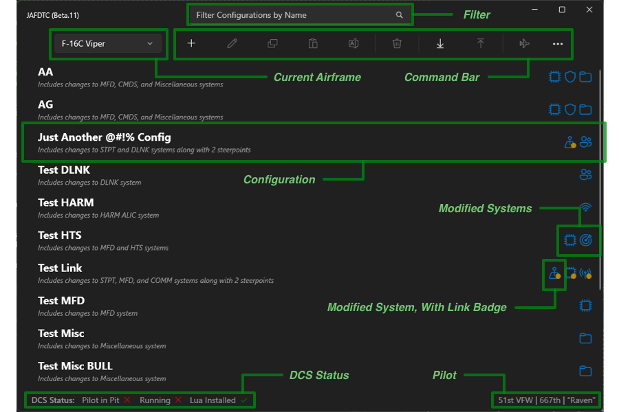

Working from top to bottom, the primary components of this page include,

- [**Filter Field**](#filter-field)
  &ndash; Filters the configurations shown in the configuration list.
- [**Current Airframe**](#current-airframe-selection)
  &ndash; Selects the current airframe to display configurations for.
- [**Command Bar**](#command-bar)
  &ndash; Triggers commands to manipulate configurations.
- [**Configuration List**](#configuration-list)
  &ndash; Lists the available configurations for the current airframe.
- [**Status Area**](#status-area)
  &ndash; Shows information on the current DCS status and pilot.

The reaminder of this section discusses each of these elements in more detail.

### Filter Field

The filter field controls which configurations the
[configuration list](#configuration-list)
in the center of the page displays. To be displayed in the configuration list, a configuration
must match the filter by containing the specified text. For example, typing `test` will match
configurations\ that contain "test" anywhere in their name (comparisons are case-insensitive).

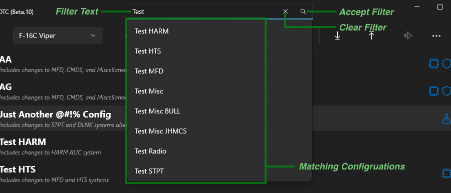

As you type, the application will show a list of matching configurations. Typing `Return` or
clicking on the **Accept Filter** icon will select the filter. You can pick a specific
configuration by clicking on its name in the matching configuration list. Clicking on the `X`
**Clear Filter** icon will remove any filtering and display all configurations.

### Current Airframe Selection

The combo box control in the upper right of the interface allows you to select the airframe
currently in use. The
[configuration list](#configuration-list)
making up the bulk of the page only displays configurations for the selected airframe. Changing
the value in this control will update the list to show only those configurations for the
selected airframe.

JAFDTC remembers the last airframe you selected and will return to that airframe the next time
it is launched.

### Command Bar

The command bar at the top of the page provides quick access to the operations you can perform
on configurations. Clicking on the `...` button at the right of the bar displays the command bar
in its "open" state.

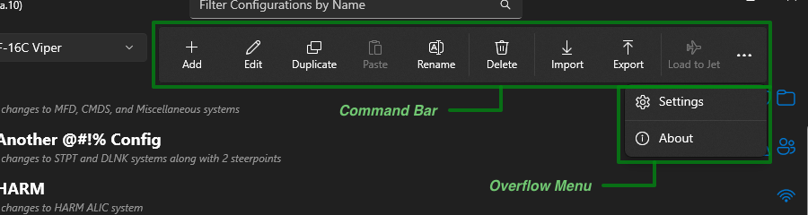

The command bar includes the following commands,

- **Add** &ndash; Adds a new configuration to the database after prompting for a name for the new
  configuration.
- **Edit** &ndash; Navigates to the
  [System Editor Page](#system-editor-page)
  for the selected configuration to allow you to edit the configuration. You can also edit a
  configuration by double-clicking on the configuration in the configuration list.
- **Duplicate** &ndash; Creates a copy of the selected configuration after prompting for a name for the
  copy of the configuration.
- **Rename** &ndash; Renames the selected configuration.
- **Delete** &ndash; Removes the currently selected configuration from the database.
- **Import** &ndash; Creates a new configuration from a file previously created with the *Export*
  command.
- **Export** &ndash; Creates a file that contains the selected configuration suitable for import using
  the *Import* command.
- **Load to Jet** &ndash; Uploads the selected configuration to DCS, see
  [here](#interacting-with-dcs)
  for further details.
- **Focus DCS** &ndash; Brings DCS to the foreground and makes it the active application.

> Importing a configuration will implicitly clear all links to other configurations that may
> have been in place at the time of export.

The overflow menu (exposed by clicking on the "..." button) holds two commands,

- **Points of Interest** &ndash; Navigates to the
  [POI Editor](#point-of-interest-database)
  page to allow you to edit points of interest.
- **Settings** &ndash; Opens up the
  [JAFDTC Settings](#settings)
  dialog to allow you to change JAFDTC settings.
- **About** &ndash; Opens a dialog box that identifies the JAFDTC version and similar information.

Depending on the state of the system, commands may be disabled. For example, **Edit** is disabled
when there is no configuration selected and **Load to Jet** is disabled if DCS is not running
a mission with the appropriate airframe.

### Configuration List

The bulk of the page is taken up by a list of defined configurations for the selected airframe.
Configurations in the list are sorted alphabetically, with favorites appearing first.
Each row in this list corresponds to a configuration. On the left side of a row is the name of
the configuration, a favorite icon (if the configuration is marked as a favorite), and a brief
summary of what changes to avionics the configuration includes. On the right side of the row is
a set of icons that also indicate which specific systems the configuration modifies. Systems
that are linked to other configurations are shown with a small gold dot in the lower right
corner. This page allows at most configuration to be selected at a time.

Double-clicking a row will open up the
[System Editor Page](#system-editor-page)
for the configuration that allows you to edit information in the configuration. Right-clicking
on a row will bring up a context menu with operations, such as **Rename** or **Delete**, that
you can perform on the clicked configuration. 

### Status Area

The status area occupies the bottom part of the configuration list page. On the right side of
this region is information showing the current status of DCS. There are three pieces of
status here, each marked with a red cross or green checkmark,

- **Lua Installed** &ndash; Indicates that the Lua support is properly installed in DCS.
- **Running** &ndash; Indicates that DCS is currently running (though not necessarily running
  a mission).
- **Pilot in Pit** &ndash; Indicates that DCS is currently running a mission along with the
  type of airframe currently in use.

For example,

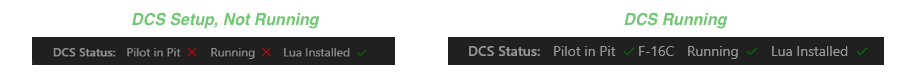

shows two different status areas. On the left, DCS is not running but the Lua support is
installed. On the right, DCS is running a mission where the player is piloting an F-16C
Viper.

The left side of the status area identifies the pilot and wing as specified through the JAFDTC
[Settings](#settings).

## System Editor Page

The *System Editor Page* provides a list of systems from which you can display per-system
editors. The specific systems availble in a configuration vary from airframe to airframe.
However, the basic structure of the page on which you edit system configurations is similar.

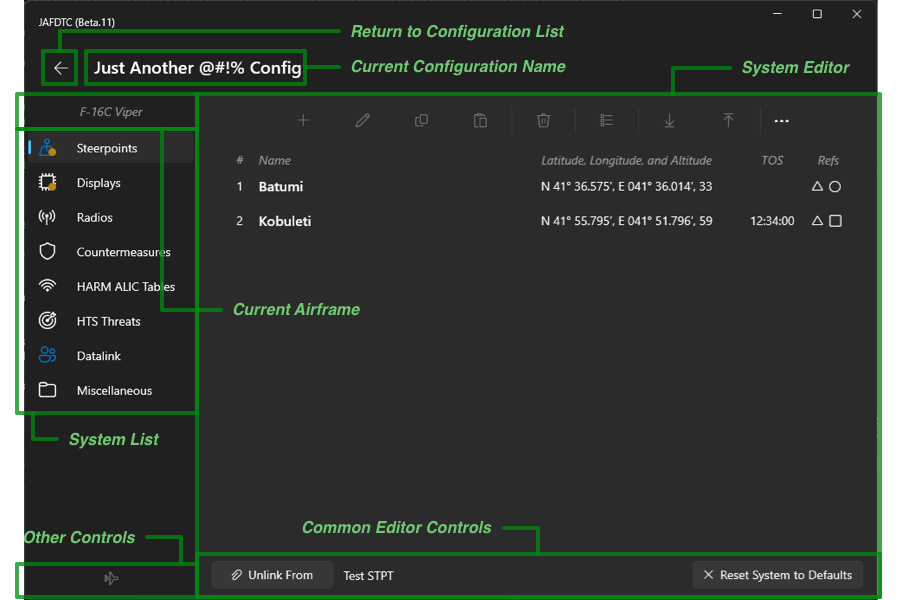

At the top of the window is the name of the current configuration being edited along with a
back button that returns you to the
[Configuration List](#configuration-list-page)
page when clicked. Below these two items is text identifying the *Current Airframe*.

### System List

The *System List* provides the systems that make up the configuration. Each system has an
associated icon. The tint of the icon indicates the state of the system: blue icons mark
systems whose configuration has changed from defaults, white icons mark systems that have not
been changed.

> JAFDTC uses the system highlight color; if you change it, the blue icons in the screenshots
> may be a different color based on your choice.

A small gold dot marks those systems that are linked to other configurations.

> A white icon with a gold dot indicates a system that is linked to another configuration
> in which the system has not been changed from defaults.

Clicking on a row in this list changes the system editor panel to the right to a panel
appropriate for editing the selected system.

### System Editor

The bulk of the page is taken up by the system editor panel on the right. The content of this
panel depends on the system selected from the *System List* to the left. In the figure above,
the editor is showing the steerpoint list associated with the selected steerpoints system. See
the
[airframe discussions](#jafdtc-users-guide)
for further details on system editors for a particular airframe.

### Common Editor Controls

Depending on the system, the bottom edge of the system configuration editor may contain link
and reset buttons that provide common link and reset functions for systems.

The **Reset** button restores the default settings to the selected system. This button is
disabled when the system is in its default configruation.

The **Link** button connects the system to another configuration. This allows you to, for
example, have a single common radio system configuration that you can share across different
configurations (as discussed
[here](#linking-systems)).
This way, you can make a single change to the shared system configuration and have the linked
systems automatically update.

> Links are tracked per system. That is, Systems A and B in Configuration X can be linked
> to completely different configurations if desired.

> At present, links are **not** preserved across export/import operations.

Changes to a system are pushed to all linked (either directly or indirectly) systems.

> For example, assume System X in Configuration A is linked to Configuration B and System X
> in Configuration B is linked to Configuration C. Changes to System X in Configuration
> C will be reflected in the Configraution A and B setups for System X.

While linked, edits to the system configuration are disabled (the system configuration is
edited through the source configuration). The *Link* button changes based on whether or not
the system is linked,

When unlinked, the button displays "Link To". Clicking the button brings up a list of
potential source configurations the system can be linked to.

> In the earlier example
> [here](#linking-systems),
> to link the MFD configuration in "A2G Fav" to "A2G Mission" you would click the "Link To"
> button in the MFD system editor in "A2G Mission" and select "A2G Fav" from the list of
> possible configurations to link to.

Once linked, the button changes to "Unlink From" and identifies the specific configuration the
system is presently linked to. When unlinking, the system configuration does not change, but
will no longer receive updates from the source configuration. Icons for linked systems are
badged with a small gold dot as described earlier.

## Point of Interest Database

JAFDTC provides a *Points of Interest* (PoI) database that contains common locations throughout
DCS theaters. This database consists of two types of entries,

- *System Entries* are entries set by DCS and cover features such as airfields.
- *User Entries* are entries defined by a user that cover features useful to a user.

While *System Entries* are fixed and immutable, users can define and managed *User Entries* as
they see fit. PoIs are applied using the **Paste PoI** command from a
[navigation point editor](#navigation-point-editor)
to copy the locations to a navigation point. User PoIs can also be created from a navigation
point editor.

The **Point of Interest** command in the
[overflow menu](#command-bar)
opens up an editor page to manage known PoIs.

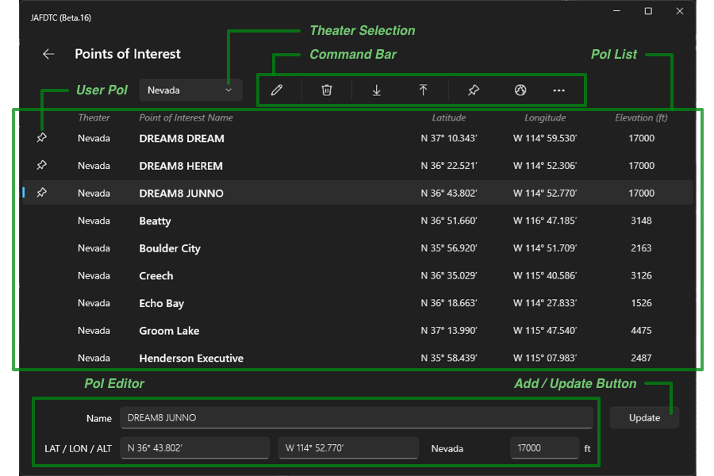

The top portion of this page contains a combo box that allows you to filter the PoIs by DCS
theater along with a command bar. Below this row is a list of PoIs, one per row. The pin icon
at the left of a row indicates that the PoI is a user PoI. At the bottom of the page is an area
to edit the properties of a PoI including the name, latitude, longitude, and elevation.

The command bar,

includes the following commands,

- **Edit** &ndash; Copies the properties from the selected PoI to the PoI editor.
- **Delete** &ndash; Deletes the selected *user* PoIs from the database.
- **Import** &ndash; Imports new PoIs from a previously exported file.
- **Export** &ndash; Exports selected *user* PoIs from the database to a file.
- **User Only** &ndash; Toggles the PoI list between showing all PoIs and only showing
  user PoIs.
- **Coordiantes** &ndash; Selects the format to use for PoI coordiantes.

After entering or updating properties for a PoI in the PoI editor, click the **Add** button
to add a new PoI to the theater (the theater is automatically determined from the latitude
and longitude). The **Add** button will be titled **Update** if the change would update an
existing user PoI.

## Settings

You can access the JAFDTC settings through the Settings button on the command bar overflow menu
as
[described earlier](#configuration-list-page). The settings dialog box appears as follows,

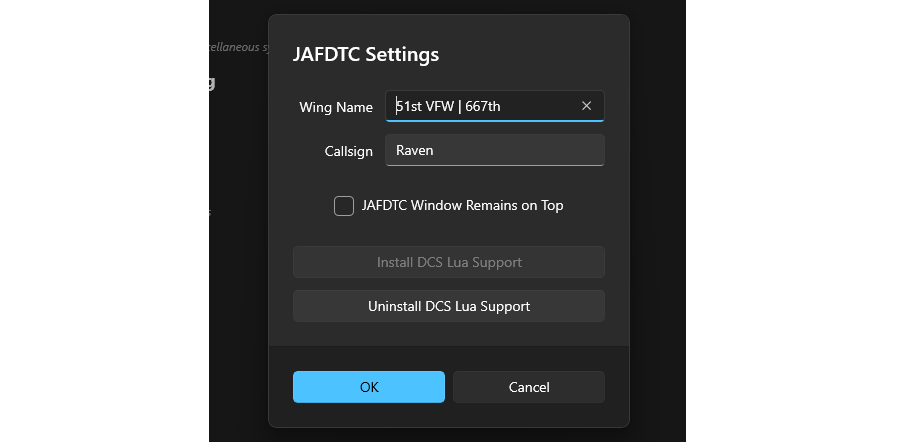

There are multiple controls in the settings,

- **Wing Name**, **Callsign** &ndash; Specifies your wing and callsign. This information
  appears in the
  [status area](#status-area)
  of the
  [configuration list page](#configuration-list-page).
  Some airframes also use this inforamtion for configuration.
- **Upload Feedback** &ndash; Selects the type of feedback to provide during uploads,
  - *Audio Only* &ndash; Audio cues at the start and completion of upload.
  - *Audio, Done Message* &ndash; Audio cues and an on-screen message in DCS indicating the
    upload has finished.
  - *Audio, Progress Messages* &ndash; Audio cues and an on-screen message in DCS indicating
    the progress of the upload.
- **Navpoint Import Ignores Airframe** &ndash; When selected, importing navpoints from a
  [file](#importing-and-exporting-navigation-points)
  will not require the airframe in the file to match the airframe of the configuration.
- **JAFDTC Window Remains on Top** &ndash; Selects whether JAFDTC will always remain on
  top of the window stack, even while DCS has focus. This allows you to keep the DCS UI
  visible in non-VR operation.
- **Check for New Versions at Launch** &ndash; Selects whether JAFDTC will check if a new
  version is available each time it is launched.
- **Install DCS Lua Support** &ndash; Installs
  [DCS Lua support](#support-scripts)
  if the support is not currently installed (the button is disabled if support is in place).
- **Uninstall DCS Lua Support** &ndash; Uninstalls
  [DCS Lua support](#support-scripts)
  if the support is currently installed (the button is disabled if support is not in place).

JAFDTC saves its settings to a file in `Documents\JAFDTC`. Clicking "OK" will accept any
changes in the dialog, while "Cancel" will discard any changes.

# Common System Editor User Interfaces

This section discusses navigation and communication system editors. Though there are often
airframe-specific differences, the editors for these systems share many common features we
will discuss.

## Navigation System Editors

Most aircraft in JAFDTC support a navigation system that allows *Navigation Points* (i.e.,
waypoints or steerpoints) to be input into the avionics as a part of a configuration. While
the interface for managing navigation points depends on the airframe, the general operation
and layout of the interface is similar.

> This is an overview of common functionality. Specific support may differ from airframe to
> airframe. As usual, consult the
> [airframe-specific documentation](#jafdtc-users-guide)
> for further details on a particular airframe.

Navigation systems typically follow a pattern where the system editor first shows a page that
contains a list of navigation points known to the system. From this page, you can jump to pages
that allow you to edit the properties of a single navigation point. 

### Navigation Point List
The first level of the interface presents a list of known navigation points. Generally, this
is the
[system editor](#system-editor)
you will see when you select the navigation system from the
[system list](#system-list).

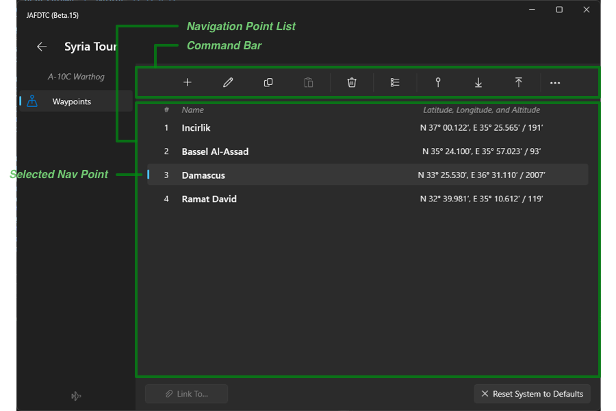

The navigation point list that makes up the bulk of the editor lists the defined navigation
points, their coordinates, name, and other airframe-specific information. This information is
formated per airframe conventions. You can select one or more navigation points from the list
using the usual Windows interactions. The command bar at the top of the editor allows you to
manipulate selected items in the navigation point list.

The command bar includes the following commands,

- **Add** &ndash; Adds a new navigation point and opens up the detail editor to set it up.
- **Edit** &ndash; Opens the selected navigation point in the
  [detail editor](#navigation-point-editor).
- **Copy** &ndash; Copy the selected navigation points to the clipboard.
- **Paste** &ndash; Paste navigation points from the clipboard into the system.
- **Delete** &ndash; Deletes the currnetly selected navigation points from the configuration.
- **Renumber** &ndash; Renumbers the navigation points starting from a specified number.
- **Capture** &ndash; Capture navigation points from the DCS F10 view and add them to the
  system.
- **Import** &ndash;
  [Import](#importing-and-exporting-navigation-points)
  navigation points from a file.
- **Export** &ndash;
  [Export](#importing-and-exporting-navigation-points)
  navigation points to a file.

All of these commands are typically available on all airframes.

### Navigation Point Editor

Editing a navigation point in the navigation point list brings up an editor page,

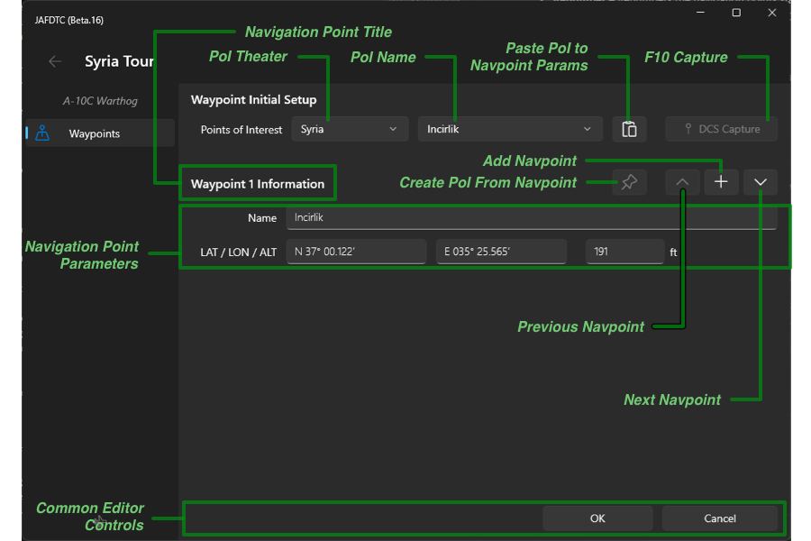

The page may differ significantly from airframe to airframe to adapt to the capabilities of the
airframe's navigation system. For example, for the Viper, the navigation point editor page
allows specification of reference points such as OAP1 and OAP2.

The top section of the page allows you to set up the navigation point from a known
*point of interest*, such as an airfield, or capture its coordinates from the F10 map in DCS as
[discussed below](#capturing-coordinates). You can select a point of interest from the drop-
down menu; pressing the **Paste** button to the right of the drop-down copies its parameters
(such as latitude or longitude) into the navigation point. Points of interest are grouped by
theater (for example, Syria, Nevada).

The next row identifies the navigation point being edited and, on the right, provides
four controls.

- The pin button creates a user point of interest from the current navigation parameters.
- The upward- and downward-pointing chevrons advance to the previous and next navigation
  point in the list, respectively.
- The `+` button in between the chevrons adds a new navigation point to the end of the list.

The page includes an area for the navigation point parameters. In this example, there are only
four: name, latitude, longitude, and altitude. The specific format of the information (for
example, latitude in degrees-minutes-seconds versus degrees-decimal minutes) depends on the
airframe. Fields will turn red if they contain an illegal value.

At the bottom of the page are “OK” and “Cancel” buttons to accept or cancel outstanding
changes. Clicking either of these buttons will take you back to the navigation point list.

### Capturing Coordinates for Navpoints

Both the navigation point list and navigation point editor pages allow you to capture
coordinates for navigation points from the DCS F10 map.

> Capturing coordinates in this fashion requires access to the F10 map. This implies a
> mission is running with a pilot slotted in.

When capturing from the list page, you may capture multiple coordinates and either append new
navigation points to the list or update existing navigation points in the list,

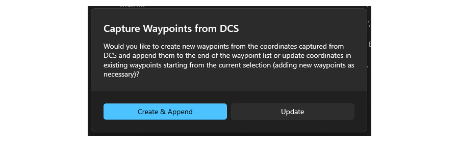

When capturing from a navigation point editor, you are always replacing the coordinate of the
navigation point being edited. If you capture more than one coordinate in this case, only the
first coordinate is used.

Once capture begins, JAFDTC displays a dialog while you interact with DCS as
[discussed below](#capturing-coordinates),

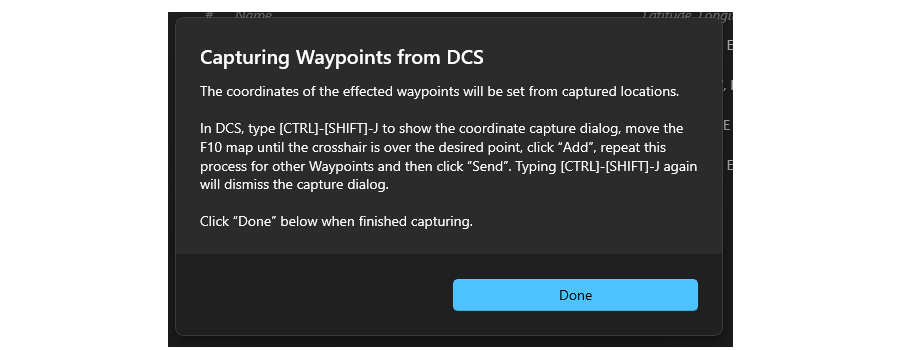

JAFDTC will interact with the coordinate capture in DCS as long as this dialog is active. After
you have completed the capture in DCS, you click “Done” in this dialog to incorporate the
captured coordinates in the navigation system.

### Importing and Exporting Navigation Points

In addition to its own `.json` format, JAFDTC can import navigation points from `.miz` and
`.cf` files directly. When importing navigation points, the imported points can either replace
or be appended to the list of currently defined navigation points.

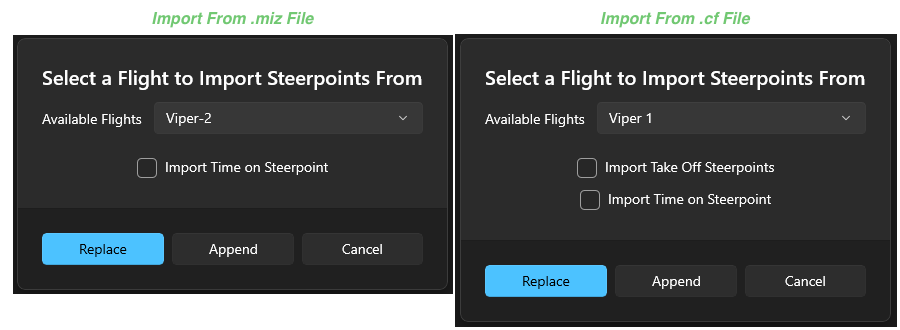

When importing from `.miz` or `.cf` files, you can select the flight within the file you wish
to import from. Based on the **Navpoint Import Ignores Airframe**
[setting](#settings),
the available flights may include only those flights matching the current airframe or any flight
from the file.

Both dialogs allow you to enable or disable the import of *Time on Steerpoint* information from
the imported file. In addition, for `.cf` files, you can choose to import the take-off
steerpoints.

## Communications System Editors

Several aircraft in JAFDTC support a communication system that allows configuration of one or
more radios in the airframe. Typical configuration includes information like preset
frequencies, enabling guard monitoring, and so on.

> This is an overview of common functionality. Specific support may differ from airframe to
> airframe. As usual, consult the
> [airframe-specific documentation](#jafdtc-users-guide)
> for further details on a particular airframe.

Communication systems typically follow a pattern where the system editor shows a list of
presets along with other controls to specify other system configuration.

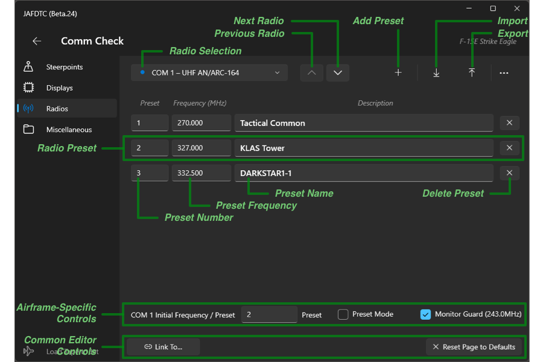

The top row of the page provides controls to select one of the radios to edit from the
communications system. A blue dot next to the name indicates the radio has been modified from
default values. The upward- and downard-pointing chevrons step through the radios.

To the right of these controls is a command bar with three commands:

- **Add** &ndash; Adds a preset to the selected radio.
- **Import** &ndash; Imports presets from a previously exported file.
- **Export** &ndash; Exports presets to a file suitable for import later.

The middle part of the page presents a list of defined presets, where each row corresponds to
a single preset for the selected radio. Each preset includes a number, frequency, and
description. The `X` button at the right of the row deletes the preset.

The bottom portion of the page includes airframe-specific controls for airframe-specific
parameters (see the
[airframe-specific documentation](#jafdtc-users-guide)
for further details) along with the common **Link** and **Reset** controls
[discussed earlier](#common-editor-controls).

# DCS Integration

JAFDTC integrates with DCS to allow you to setup your jet according to a configuration and
perform other operations with DCS. The availability of specific capabilities may vary from
airframe to airframe.

## Applying Configurations

> All airframes support this capability.

The primary interaction between JAFDTC and DCS involves uploading configurations to the jet.
Some airframes also support additional interactions with the JAFDTC UI as the
[airframe-specific documentation](#jafdtc-users-guide)
describes.

To be able to upload a configuration for a particular airframe, four conditions must hold,

1. A configuration must be selected
2. The DCS scripting support must be
   [installed](#support-scripts)
3. DCS must be running
4. A mission must be running with a pilot in pit in an airframe that matches the airframe of
   the configuration selected in (1)

The lower left corner of the main configuration list page indicates the status conditions 2-4
as
[discussed earlier](#status-area).
Once these conditions are met, you can use the **Load to Jet** button from the
[command bar](#command-bar)
or context menu item, to load the currently selected configuration into the jet. Note that,
generally, the upload should take place before any changes are made with the avionics. Also,
as JAFDTC works through the clickable cockpit, you should limit your interactions with cockpit
switches while JAFDTC is loading a configuration.

> In some cases, it is difficult to impossible for JAFDTC to get the jet in a known
> configuration from a non-default starting point. In these situations, JAFDTC must rely on the
> avionics being in a known state coming out of a cold or hot start. For example, if there is a
> 4-position switch whose setting JAFDTC is unable to read, JAFDTC will not be able to reliably
> set the switch to a particular setting except if assumes the switch hasn't changed positions
> since mission start.
>
> For these reasons, it is generally advisable to perform uploads prior to manually changing
> any avionics settings that overlap with those in the configuration.

Some airframes can also trigger JAFDTC operations through buttons in the cockpit. For example,
in the Viper, JAFDTC allows you to use the **FLIR WX** button to trigger configuration upload

> For further information on JAFDTC actions that can be triggered from within the cockpit in
> DCS, see the
> [airframe-specific documentation](#jafdtc-users-guide).

## Capturing Coordinates

> All airframes support this capability, but its application may differ.

JAFDTC can
[capture coordinates](#capturing-coordinates-for-navpoints)
from the DCS F10 map to use in navigation points for the navigation system in a configuration.

> You must be in an in-mission slot viewing the F10 map in order to capture coordiantes.
> Capture does not work from the DCS Mission Editor.

> As always, consult the
> [airframe-specific documentation](#jafdtc-users-guide)
> for details on what a specific airframe supports.

The JAFDTC side of this interaction was
[described earlier](#capturing-coordinates-for-navpoints).
Once JAFDTC presents the “Capturing” dialog, the interaction switches to the DCS F10 map.
From the F10 map, type `CTRL`-`SHIFT`-`J` to show the JAFDTC capture overlay on the F10
map,

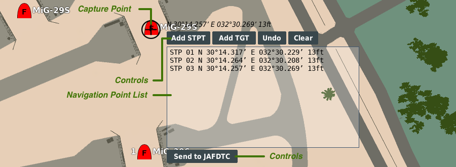

At the upper left of the overlay is a cursor made up of a `+` icon within a circle that
indicates where on the map coordinates are captured from. To the right of this are the
latitude, longitude, and elevation of the point under the `+`. To change the coordinate, move
the F10 map as normal.

> The overlay remains at a fixed location on the screen while the map moves under the overlay.

The remainder of the overlay includes a list of captured navigation points along with several
buttons to interact with the list.

- **Add STPT** &ndash; Adds the location under the cursor to the list of navigation points as a
  steerpoint.
- **Add TGT** &ndash; Adds the location under the cursor to the list of navigation points as a
  target.
- **Undo** &ndash; Removes the last navigation point added to the list.
- **Clear** &ndash; Clears the list of navigation points.
- **Send to JAFDTC** &ndash; Sends the navigation points in the list to JAFDTC to incorporate.

The handling of target versus steerpoints added by **Add STPT** and **Add TGT** commands
depends on the specific airframe.

After sending the navigation points to JAFDTC, you must dismissing the “Capturing” dialog as
[discussed above](#capturing-coordinates-for-navpoints).

## Changing the Selected Configuration

> Some airframes support this capability.

Some airframes can allow changes to the currently selected configuration through DCS rather
than the JAFDTC Windows UI. This is helpful for VR and other uses where it may be difficult
to interact with the Windows UI.

With this capability, you can step sequentially through the configurations. As you change
the configuration in this fashion, JAFDTC will display a small window in DCS with the name
of the currently selected configuration,

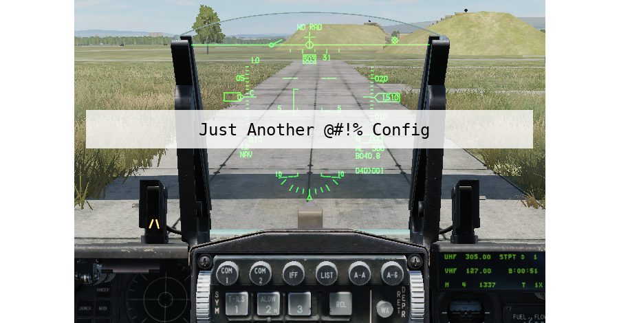

This window is only displayed briefly as you step through configurations.

## Support Scripts

To interoperate with DCS, JAFDTC installs Lua within the `Scripts` hierarchy in the DCS
installation(s) present in the `Saved Games` folder associated with your profile. JAFDTC can
install this support in up to two places,

- `Saved Games\DCS\Scripts`
- `Saved Games\DCS.openbeta\Scripts`

depending which versions of DCS are installed on your system. Within these areas, JAFDTC makes
three changes,

- Adds scripts in the `Scripts\JAFDTC` folder to enable integration with supported airframes
- Adds `JAFDTCStatusMsgHook.lua` and `JAFDTCWyptCaptureHook.lua` script to the `Scripts\Hooks`
  folder to enables integration with DCS
- Adds a line to `Scripts\Export.lua` to load JAFDTC support into DCS at mission start

JAFDTC will automatically update these files as needed, notifying you when an update is made.

> If DCS is running when JAFDTC installs or updates the DCS support scripts, you should restart
> DCS to make sure DCS picks up the latest version of the DCS support.

While JAFDTC allows you to decline the installation, doing so will prevent JAFDTC from
interacting with DCS in any capacity.
